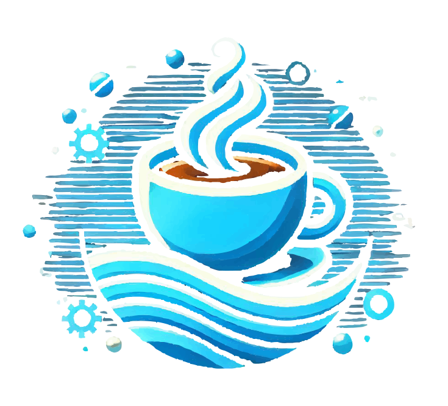

[](https://search.maven.org/search?q=g:com.github.cowwoc.digitalocean)
[](../../actions?query=workflow%3Abuild)

#  DigitalOcean Java Client

[](https://cowwoc.github.io/digitalocean/0.1/docs/api/)
[](docs/Changelog.md)

A Java client for the [DigitalOcean](https://www.digitalocean.com/) cloud platform.

To get started, add this Maven dependency:

```xml

<dependency>
  <groupId>com.github.cowwoc.digitalocean</groupId>
  <artifactId>java</artifactId>
  <version>0.1</version>
</dependency>
```

## Usage Example

```java
import com.github.cowwoc.digitalocean.exception.PermissionDeniedException;
import com.github.cowwoc.digitalocean.resource.Droplet;
import com.github.cowwoc.digitalocean.resource.DropletImage;
import com.github.cowwoc.digitalocean.resource.DropletType;
import com.github.cowwoc.digitalocean.resource.Vpc;
import com.github.cowwoc.digitalocean.resource.Zone;
import com.github.cowwoc.digitalocean.scope.DefaultJvmScope;
import com.github.cowwoc.digitalocean.scope.DigitalOceanScope;
import com.github.cowwoc.digitalocean.scope.JvmScope;
import com.github.cowwoc.digitalocean.scope.MainDigitalOceanScope;
import com.github.cowwoc.digitalocean.util.Configuration;

import java.io.IOException;
import java.nio.file.Paths;
import java.util.concurrent.TimeoutException;

public final class Example
{
	public static void main(String[] args)
		throws PermissionDeniedException, IOException, TimeoutException, InterruptedException
	{
		Configuration configuration = Configuration.combine(
			Configuration.fromPath(Paths.get("deployment.properties")),
			Configuration.fromEnvironmentVariables());
		String digitalOceanToken = configuration.getString("CLOUD_ACCESS_TOKEN");

		try (JvmScope jvm = new DefaultJvmScope(configuration);
		     DigitalOceanScope scope = new MainDigitalOceanScope(jvm, digitalOceanToken))
		{
			DropletImage image = DropletImage.getBySlug(scope, "debian-12-x64");
			DropletType type = DropletType.BASIC_1_VCPU_2GB_RAM_50GB_DISK;
			Vpc vpc = Vpc.getDefault(scope, Zone.NYC3);
			Droplet droplet = Droplet.builder(scope, "Node123", type, image, vpc).create();
			while (droplet.getAddresses().isEmpty())
				Thread.sleep(1000);
			System.out.println("The droplet's address is: " + droplet.getAddresses().getFirst());
		}
	}
}
```

## Entry Points

See the [API documentation](https://cowwoc.github.io/digitalocean/0.1/docs/api/) for more details.

## Licenses

* This library is licensed under the [Apache License, Version 2.0](LICENSE)
* See [Third party licenses](LICENSE-3RD-PARTY.md) for the licenses of the dependencies