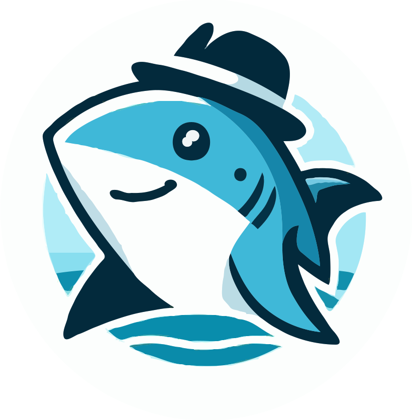

[](https://search.maven.org/search?q=g:com.github.cowwoc.digitalocean)
[](../../actions?query=workflow%3Abuild)

#  DigitalOcean Java Client

[](https://cowwoc.github.io/digitalocean/0.9/)
[](docs/changelog.md)

A Java client for the [DigitalOcean](https://www.digitalocean.com/) cloud platform.

To get started, add this Maven dependency:

```xml

<dependency>
  <groupId>com.github.cowwoc.digitalocean</groupId>
  <artifactId>digitalocean</artifactId>
  <version>0.9</version>
</dependency>
```

## Example

```java
import com.github.cowwoc.digitalocean.client.DigitalOceanClient;
import com.github.cowwoc.digitalocean.exception.PermissionDeniedException;
import com.github.cowwoc.digitalocean.resource.Droplet;
import com.github.cowwoc.digitalocean.resource.DropletImage;
import com.github.cowwoc.digitalocean.resource.DropletType;
import com.github.cowwoc.digitalocean.resource.Region;
import com.github.cowwoc.digitalocean.resource.Zone;

import java.io.IOException;
import java.util.Comparator;
import java.util.concurrent.TimeoutException;

class Example
{
  public static void main(String[] args)
    throws PermissionDeniedException, IOException, TimeoutException, InterruptedException
  {
    Region region = Region.NEW_YORK;
    try (DigitalOceanClient client = DigitalOceanClient.using("MY_ACCESS_TOKEN"))
    {
      DropletImage image = DropletImage.getBySlug(client, "debian-12-x64");
      Zone zone = region.getZones(client).iterator().next();
      
      // Get the least expensive droplet type with at least 2 GiB of memory
      DropletType dropletType = DropletType.getAll(client).stream().filter(type ->
        type.getZones().contains(zone.getId()) && type.getRamInMiB() >= 2 * 1024).
        min(Comparator.comparing(DropletType::getPricePerHour)).orElseThrow();
      
      Droplet droplet = Droplet.creator(client, "Node123", dropletType.getId(), image).create();
      while (droplet.getAddresses().isEmpty())
        Thread.sleep(1000);
      System.out.println("The droplet's address is: " + droplet.getAddresses().iterator().next());
    }
  }
}
```

## Getting Started

See the [API documentation](https://cowwoc.github.io/digitalocean/0.9/) for more details.

## Licenses

* This library is licensed under the [Apache License, Version 2.0](LICENSE)
* See [Third party licenses](LICENSE-3RD-PARTY.md) for the licenses of the dependencies